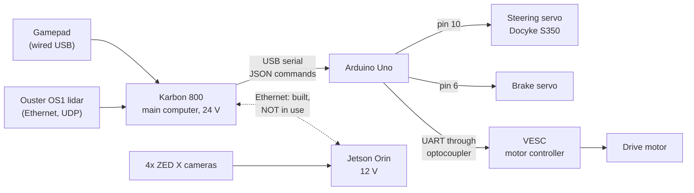
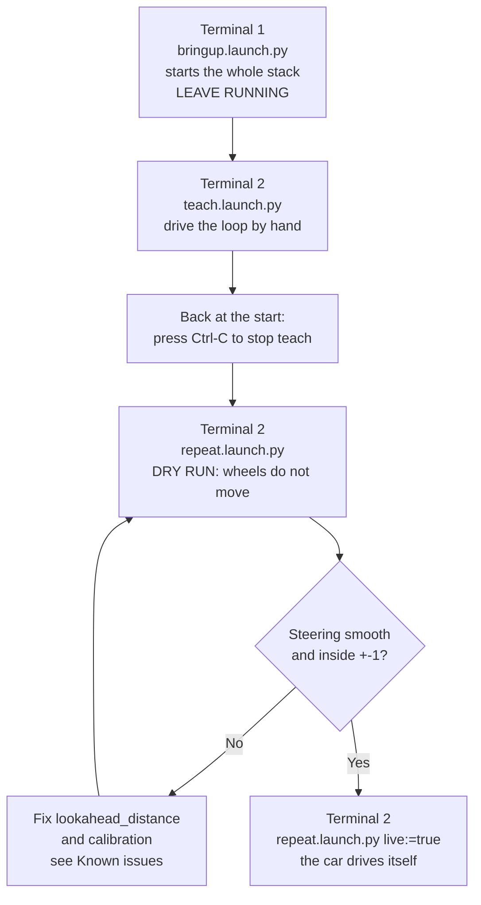
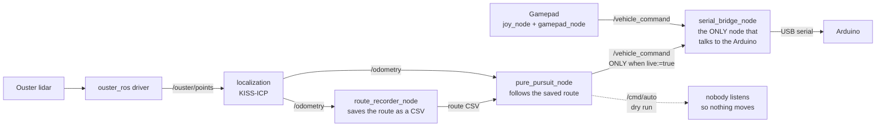

# 1811 Vehicle Software

Software for **1811**, a small electric vehicle that can be driven by gamepad and can
**teach and repeat** a route: you drive a loop by hand once, and the car then drives the
same loop by itself using its lidar. It is a [ROS 2 Humble](https://docs.ros.org/en/humble/)
project and everything runs inside Docker.

> [!IMPORTANT]
> **New here? Read [Start here](#start-here) first (about 10 minutes).** The most common
> beginner mistake is typing a command in the wrong place. See
> [Host vs container](#host-vs-container-where-do-i-type-this).

## Contents

| I want to... | Go to |
|---|---|
| Understand what this project is and what works | [Start here](#start-here) |
| Know what is physically on the car and how to power it | [The vehicle (hardware)](#the-vehicle-hardware) |
| Set up my laptop the first time | [First-time setup](#first-time-setup) |
| Open a terminal and build the code | [Daily use](#daily-use) |
| Drive the car (gamepad, keyboard, or autonomous) | [Driving the vehicle](#driving-the-vehicle) |
| Understand how the software fits together | [How the software works](#how-the-software-works) |
| Change steering or brake behavior | [Firmware](#firmware) |
| Fix something that is broken | [Troubleshooting](#troubleshooting) |
| Know what is dangerous or unfinished | [Safety](#safety) and [Known issues](#known-issues) |
| Set up on WSL (Windows) | [Machine-specific setup](#machine-specific-setup) |
| Find a specific file | [Where to find things](#where-to-find-things) |

---

## Start here

### What is 1811?

1811 is a vehicle with two on-board computers, a lidar (laser scanner), cameras, an Arduino
that drives the actuators, and a motor controller. Today the software does three things:

1. **Manual driving**: steer, throttle, and brake with a gamepad or keyboard.
2. **Localization**: work out where the car is using only the lidar (no GPS).
3. **Teach and repeat**: record a loop while you drive it, then drive it back autonomously.

Everything else (cameras, radar, obstacle detection, a proper safety layer) is not built yet.
See the status table below.

### Status at a glance

| Area | Status | Notes |
|---|---|---|
| Manual driving (gamepad, keyboard) | ✅ Works | Use a **wired** gamepad. |
| Lidar and odometry | ✅ Works | Needs `udp_profile_lidar:=LEGACY` (sensor firmware 3.0.1). |
| Teach and repeat | ✅ Works | **No deadman switch.** A human at the kill switch is required. |
| One-command startup (`obc_bringup`) | ✅ New | Verify with the dry run before driving for real. |
| Cameras (4× ZED X) | 🚧 Hardware mounted | No software uses them yet. |
| Radar (Smartmicro DRVEGRD 169) | 🚧 Driver in repo; hardware bring-up open | Submodule `smartmicro_ros2_radars` + `scripts/fetch_radar_deps.sh`. Link/IP still TBD. |
| Jetson ↔ Karbon Ethernet link | 🚧 Wired, not in use | The two computers are not sharing one ROS graph today. |
| Obstacle detection and sensor fusion | ❌ Not built | The car cannot see or avoid anything. |
| `mode_manager` (deadman, manual/auto switching) | ❌ Not built | **Biggest safety gap.** |
| Arduino telemetry (car reporting back) | ❌ Disabled | It corrupted the command link once. |

### Words you will see

| Word | Plain-English meaning |
|---|---|
| **ROS 2** | A framework that splits a robot program into many small programs that talk to each other. |
| **Node** | One small running program, for example `gamepad_node`. |
| **Topic** | A named channel that nodes publish messages to and read from, for example `/vehicle_command`. |
| **Launch file** | A file that starts several nodes at once (`ros2 launch ...`). |
| **Package** | A folder of code under `ros2_ws/src/`, for example `control`. |
| **Workspace** | `ros2_ws/`, the folder where all the packages are built. |
| **`colcon build` / `rebuild`** | Prepares your code so ROS can run it. Run it after code changes. **This is not `docker build`.** |
| **Docker container** | A sealed Linux environment that already contains ROS 2. You run all ROS commands inside it. |
| **Host** | Your actual computer (laptop or Karbon), *outside* the container. |
| **Karbon 800** | The rugged industrial computer on the car. It runs the lidar driver, localization, control, and talks to the Arduino. |
| **Jetson Orin** | A second computer, meant for the cameras and heavy processing. Not used yet. |
| **Arduino Uno** | A small microcontroller that turns commands into steering, brake, and motor signals. |
| **VESC** | The motor controller for the drive motor. The Arduino talks to it. |
| **Lidar (Ouster OS1)** | A spinning laser scanner that produces a 3D point cloud of its surroundings. |
| **Odometry** | The car's estimated position and heading. Here it comes from comparing consecutive lidar scans (KISS-ICP). |
| **`odom` frame** | The coordinate system whose origin is *where localization started*. Restarting localization moves this origin. |
| **URDF / TF** | A model of where each sensor sits on the car, so lidar readings can be converted into car coordinates. |
| **Pure pursuit** | The algorithm that steers toward a point a set distance ahead ("lookahead") on the saved route. |
| **Teach / Repeat** | TEACH = you drive and the car records. REPEAT = the car drives the recording. |
| **Dry run** | REPEAT with the wheels disabled. It only prints what the car *would* do. |
| **Deadman switch** | A control that stops the car when you let go of it. **1811 does not have one yet.** |
| **Kill switch** | The physical switch that cuts power to the car. |
| **DDS** | The network layer ROS 2 uses so nodes can find each other. |

### Host vs container: where do I type this?

Most confusion comes from this. There are **two places** you can type commands.

```
┌─ HOST (your laptop or the Karbon) ─────────────────────────────────────────┐
│  git, docker, ./scripts/dev.sh, ls /dev/serial/by-id/                      │
│                                                                            │
│   ┌─ CONTAINER (opened by ./scripts/dev.sh) ─────────────────────────────┐ │
│   │  ros2 ..., rebuild, colcon ..., ros2 launch ..., ros2 topic ...      │ │
│   └──────────────────────────────────────────────────────────────────────┘ │
└────────────────────────────────────────────────────────────────────────────┘
```

| Command | Run it on the |
|---|---|
| `git ...`, `docker ...`, `docker compose ...` | **Host** |
| `./scripts/dev.sh` (opens the container) | **Host** |
| `ls -l /dev/serial/by-id/` (does the host see the Arduino?) | **Host** |
| `ros2 ...` (`launch`, `topic`, `node`, `run`, `service`) | **Container** |
| `rebuild`, `colcon build ...` | **Container** |

**How to tell where you are:** inside the container your prompt looks like
`root@<computer-name>:/vehicle_1811/ros2_ws#`. If you see your normal prompt, you are on the
host.

> [!WARNING]
> Typing `rebuild` or `ros2 ...` on the host gives `command not found`. Nothing is broken:
> you just forgot to open the container. Run `./scripts/dev.sh` first.

### What do you want to do?

| Goal | Steps |
|---|---|
| **Just read the code** | Nothing to install. Start at [Where to find things](#where-to-find-things). |
| **Test path following with no car** | [First-time setup](#first-time-setup), then [Testing without the car](#testing-without-the-car). |
| **Drive the car by gamepad** | [Power on](#power-on-and-off), [Daily use](#daily-use), then [Manual driving with the gamepad](#manual-driving-with-the-gamepad). |
| **Teach and repeat a route** | [Power on](#power-on-and-off), [Daily use](#daily-use), then [Teach and repeat](#teach-and-repeat-autonomous-driving). |
| **Change steering or brake behavior** | [Firmware](#firmware). You must reflash the Arduino. |
| **Change where a sensor is mounted** | Edit `ros2_ws/src/vehicle_1811_description/urdf/vehicle_1811.urdf.xacro`, then `rebuild`. |

---

## The vehicle (hardware)

### What is on board



| Part | What it does | Used by software today? |
|---|---|---|
| **Karbon 800** (24 V) | Main computer. Runs everything in this repo. | ✅ Yes |
| **Jetson Orin AGX** (12 V) | Meant for cameras and heavy processing. | ❌ No |
| **Ouster OS1 lidar** | 3D laser scanner, connected to the Karbon. | ✅ Yes (the only sensor in use) |
| **4× ZED X cameras** | Connected to the Jetson. | ❌ No |
| **Smartmicro DRVEGRD 169 radar** | Connected through a 100BASE-T1 → 100BASE-TX media converter. | ❌ Not working yet |
| **Arduino Uno** | Converts commands to servo and motor signals. Firmware in `firmware/`. | ✅ Yes |
| **Steering servo** (Docyke S350) | Turns the wheels. Arduino pin 10. | ✅ Yes |
| **Brake servo** | Applies the brake. Arduino pin 6. | ✅ Yes |
| **VESC** | Drives the traction motor. | ✅ Yes |

For the planned two-computer design, read
[`docs/compute_and_sensor_topology.md`](docs/compute_and_sensor_topology.md) before wiring up
anything that uses both lidar and camera data.

### Power on and off

> [!WARNING]
> **Order matters. Do not skip the precharge step.**

**Power on**

1. Turn the **precharge switch (the fuse switch) ON**. Wait a few seconds.
2. Then turn the **key**.

**Why:** the motor controller has a bank of capacitors that start empty. The precharge switch
fills them slowly through a current-limiting path. Turning the key first connects the full
battery pack to empty capacitors, and the surge can weld the contactor shut or blow the fuse.
The wait between the two steps is the whole point, not a formality.

**Power off**

1. Turn the **key (contactor) OFF** and confirm it is off before leaving the vehicle. An
   energized contactor keeps the traction power live.

### Power distribution

| Component | Supply |
|---|---|
| Jetson Orin AGX | 12 V |
| Jetson expansion board | 12 V |
| Karbon 800 | 24 V |
| Contactor coil | 12 V battery, trickle-charged from the main pack |

The 12 V contactor battery recharges from the main battery, so it needs no separate charging
in normal use.

### Arduino ↔ motor controller

The Arduino talks to the motor controller over **UART through an optocoupler**. This keeps the
Arduino's logic ground electrically separate from the high-current motor ground. It is
deliberate: connecting them directly would send motor switching noise into the control link.

The Arduino *can* send messages back to the Karbon, but that is currently
**disabled** (see [Firmware](#firmware)).

### Manual controls

The car's manual throttle and brake should be configured and working. Check them before relying
on them as a fallback.

### Known mechanical issues

| Issue | Why it matters | What to do |
|---|---|---|
| **Steering shaft collar works loose.** The two set screws holding the motor attachment to the steering shaft loosen under repeated load. | The wheel gets slack and won't return to center. It looked like ~2° of gearbox backlash, and a software fix was written for it before the real cause was found. | **Check these screws first** before chasing steering play in software. Fix with correctly sized bolts plus threadlocker. |
| **Steering throw is asymmetric.** The motor travels further left than right, even though the pulse widths are symmetric (1150 ± 417 µs). | Most likely servo horn clocking. `pure_pursuit` assumes equal turning both ways, so it over-steers one direction and under-steers the other, and on a closed loop the error accumulates. | Fix mechanically if possible. Otherwise split `STEER_SPAN_US` into separate left/right constants in the firmware. |
| **Front grill lights disconnected** (not soldered properly). | None for driving. | Low priority. |
| **Some wires hang near the ground.** | Snag and abrasion risk. | Zip-tie them (low effort). |

---

## First-time setup

Do this once per computer. **No ROS 2 install is needed** on any machine: the Docker container
brings its own Ubuntu 22.04 and ROS 2 Humble. The host only needs Docker, on the Karbon
(Ubuntu 24.04), a Linux laptop, or Windows via WSL.

Run these on the **host**:

```bash
git clone https://github.com/Nova-UTD/1811-fall-2026.git
cd 1811-fall-2026
git submodule update --init --recursive     # ouster-ros, kiss-icp, smartmicro_ros2_radars
bash scripts/fetch_radar_deps.sh            # Smart Access libs (license accept; skipped if already present)
bash scripts/setup_machine.sh               # installs Docker if missing, builds the image
```

What each step does:

| Step | What it does | Notes |
|---|---|---|
| `git submodule update ...` | Downloads three third-party projects: the Ouster lidar driver (`ouster-ros`), `kiss-icp` (localization), and `smartmicro_ros2_radars` (radar driver). | Without it those folders are **empty** and the build fails. |
| `fetch_radar_deps.sh` | Runs smartmicro's `smart_extract.sh` to download the Smart Access Automotive binaries into the submodule. | Those libs are **gitignored** inside the submodule, so every machine must run this once. `setup_machine.sh` also calls it. |
| `setup_machine.sh` | Checks for Docker (installs it on native Linux), adds you to the `docker` group, fetches radar deps if needed, and builds the `vehicle_1811` image. | The first build takes several minutes. If it adds you to a group, **log out and back in**, then run it again. |

On WSL, do the [usbipd steps](#wsl-windows-laptop) before expecting any USB device (Arduino,
gamepad) to show up.

---

## Daily use

Every time you sit down to work, open a terminal in the repo root **on the host** and run:

```bash
./scripts/dev.sh
```

This one command:

1. Starts the Docker container if it is not already running.
2. Builds the workspace **the first time only** (this takes several minutes because it
   compiles the Ouster driver and KISS-ICP).
3. Opens a shell **inside** the container. Your prompt changes to
   `root@...:/vehicle_1811/ros2_ws#`.

That's all. There is **no `cd` and no `source`**: every shell opens already in
`/vehicle_1811/ros2_ws` with ROS 2 and the built workspace ready, so `ros2 launch ...` works on
the first line you type. The repo is shared into the container at `/vehicle_1811`, so edits you
make on the host appear inside instantly.

**Need more terminals?** Run `./scripts/dev.sh` again in each new terminal window. Each one
opens another shell in the *same* container.

> [!TIP]
> Always use `./scripts/dev.sh` (which uses `docker compose exec`) for extra terminals, not
> `docker compose run`. Each `run` creates a *separate* container, and separate containers can
> make ROS nodes confuse each other (see [Known issues](#known-issues)).
> `docker compose run --rm dev bash` still works for a throwaway one-off shell.

### Rebuilding after code changes

Inside the container:

```bash
rebuild
```

`rebuild` is a shortcut for `colcon build --symlink-install && source install/setup.bash`.
It prepares **your ROS code**. It is *not* `docker build`.

| You changed... | What to do |
|---|---|
| Python code in an existing package | **Nothing.** `--symlink-install` makes edits take effect immediately. |
| C++ code, a new or removed package, `package.xml`, or `CMakeLists.txt` | `rebuild` |
| Only one or two packages (faster) | `colcon build --symlink-install --packages-select control routing teleop_bridge && source install/setup.bash` |
| The `Dockerfile` (apt/pip packages, shell setup) | On the host: `docker compose build`, then reopen with `./scripts/dev.sh` |

`rebuild` skips `smart_rviz_plugin` (Humble does not support smartmicro's RViz plugins; the radar **driver** still builds).

> [!NOTE]
> **Config edits not taking effect?** If a package was ever built *without*
> `--symlink-install`, `install/` holds real copies of your files and later builds will not
> replace them. You keep editing `src/` while the node reads a stale copy. See
> [A yaml edit doesn't reach the node](#a-yaml-edit-doesnt-reach-the-node).

### Docker services

`docker-compose.yml` defines two services:

- **`dev`**: the general development container, used everywhere (this is what `dev.sh` opens).
- **`obc`**: same image, intended for the Karbon as the real on-board computer. It exists
  separately so Karbon-specific settings (fixed serial path, autostart) have a home without
  touching `dev`.

The containers run `privileged: true`, which gives full device access (so you don't need to
fuss with `dialout` permissions inside). `pid: "host"` shares the host process-ID space so ROS
network identities stay distinct across containers.

---

## Driving the vehicle

### Before you drive: checklist

- [ ] Powered on in the correct order ([Power on](#power-on-and-off)).
- [ ] **Wired** gamepad plugged in.
- [ ] Arduino plugged into the Karbon (the blue USB cable).
- [ ] `./scripts/dev.sh` is running and you are **inside the container**.
- [ ] For anything new or autonomous: **a spotter is present and a hand is on the kill switch.**
- [ ] For the first run of any new code: **wheels off the ground.**

### Manual driving with the gamepad

```bash
ros2 launch teleop_bridge teleop_bridge.launch.py
```

This starts three nodes: `joy_node` (reads the gamepad), `gamepad_node` (turns it into a
command), and `serial_bridge_node` (sends the command to the Arduino).

**Controls** (8BitDo SN30 Pro, **wired**):

| Control | Does |
|---|---|
| Left stick up/down | Throttle |
| Right stick left/right | Steering |
| Left trigger | Brake (overrides throttle) |

**Serial port.** The launch file's default port is `/dev/ttyACM0`, but `ttyACM*` numbers are
assigned in plug order and change after replugs and reboots. That is how the bridge once ended
up writing JSON at a Linux console. For a stable path, find the Arduino's permanent name **on
the host** and pass it in:

```bash
ls -l /dev/serial/by-id/
```

```bash
ros2 launch teleop_bridge teleop_bridge.launch.py port:=/dev/serial/by-id/usb-Arduino__www.arduino.cc__0043_XXXX-if00
```

`serial_bridge_node` also supports `port:=auto`, which finds the Arduino through
`/dev/serial/by-id/` itself. That default is currently commented out in the launch file, so it
only applies if you set it explicitly or run the node directly.

<details>
<summary><b>Gamepad axis details (open if the controls feel wrong)</b></summary>

Measured on this pad, **wired**:

| Axis | Control | Sign | Used as |
|---|---|---|---|
| `axes[0]` | left stick X | right = **negative** | unused |
| `axes[1]` | left stick Y | up = **positive** | throttle |
| `axes[2]` | left trigger | rests **+1.0**, falls to −1.0 when pressed | brake |
| `axes[3]` | right stick X | right = **negative** | steering |
| `axes[4]` | right stick Y | up = **positive** | unused |

`INVERT_STEER = True` because right reads negative on `axes[3]`. `INVERT_THROTTLE = False`
because up already reads positive on `axes[1]`.

**Axis numbers depend on the pad's mode**, which is chosen by a button combination at
power-on, **not by the cable**. Over Bluetooth this pad reported steering on `axes[2]` and the
trigger on `axes[5]`. Re-check after any power-cycle into another mode, a pad swap, or a
repair:

```bash
ros2 topic echo /joy
```

Move one control at a time and compare with the table above and the constants in
[`gamepad_node.py`](ros2_ws/src/teleop_bridge/teleop_bridge/gamepad_node.py). `gamepad_node`
refuses to publish (and logs why) if `/joy` has fewer axes than it reads, rather than crashing
mid-drive.

</details>

### Manual driving with the keyboard

Two terminals, both inside the container.

**Terminal 1**: the serial bridge only (no gamepad):

```bash
ros2 launch teleop_bridge teleop_bridge.launch.py use_gamepad:=false
```

**Terminal 2**: the keyboard window:

```bash
ros2 run teleop_bridge keyboard_teleop_node
```

Click into the **pygame window** (not the terminal) so it receives keys. Arrows drive, Shift
brakes (overrides throttle), `+` / `-` adjust the speed scale, `q` or `Esc` quits. This needs a
display: see [GUI apps](#gui-apps-pygame-window).

### Lidar and odometry only

Use this to check that the lidar and localization work, without recording or driving. Three
terminals, all inside the container. (The
[Teach and repeat](#teach-and-repeat-autonomous-driving) command starts all of this for you.)

**Terminal 1**: the vehicle model and TF tree. **This is required before odometry:**

```bash
ros2 launch vehicle_1811_description description.launch.py
```

`localization.launch.py` asks KISS-ICP to report the position of `base_link` (the *car*), not
of the sensor. That conversion needs the `base_link → os_sensor → os_lidar` chain, which only
exists while this launch file is running. Without it the TF tree has only
`os_sensor → os_lidar/os_imu` and **no `base_link`**, so the odometry you record is wrong or
missing. Confirm the tree before trusting a route:

```bash
ros2 run tf2_tools view_frames
```

You want `base_footprint → base_link → os_sensor → os_lidar` plus the wheel and camera frames.
If you only see `os_sensor` and its children, this launch file isn't running.

**Terminal 2**: the Ouster lidar driver:

```bash
ros2 launch ouster_ros sensor.launch.xml sensor_hostname:=<sensor-ip> viz:=false udp_profile_lidar:=LEGACY
```

- `<sensor-ip>` is the lidar's IP address or hostname.
- `viz:=false` matters on the Karbon: it has no monitor, and `rviz2` crashes without one.
- `udp_profile_lidar:=LEGACY` works around a bug in sensor firmware 3.0.1. See
  [Known issues](#known-issues).

**Terminal 3**: odometry:

```bash
ros2 launch localization localization.launch.py
```

Check it works:

```bash
ros2 topic hz /odometry
```

You should see roughly the lidar's scan rate (about 10 to 20 Hz).

### Teach and repeat (autonomous driving)

You drive a loop by hand while the car records where it goes (**TEACH**). Then the car drives
that loop by itself (**REPEAT**). It needs **two terminals**, both inside the container.



> [!CAUTION]
> **Do not restart Terminal 1 between TEACH and REPEAT.** Restarting it restarts the lidar
> localization, which moves the `odom` origin. The saved route then silently stops matching
> reality, with **no error**, and the car drives to the wrong place.

| Step | Terminal | Command | What it does |
|---|---|---|---|
| 1 | **1** | `ros2 launch obc_bringup bringup.launch.py lidar_ip:=<sensor-ip>` | Starts everything that must stay up: vehicle model and TF, Ouster driver, KISS-ICP localization, route recorder (already recording), and the serial bridge to the Arduino. **Leave it running.** |
| 2 | **2** | `ros2 launch obc_bringup teach.launch.py` | **TEACH.** Starts the gamepad. Drive the loop and stop back where you started. Then press `Ctrl-C`. |
| 3 | **2** | `ros2 launch obc_bringup repeat.launch.py` | **Dry run.** Saves the route, then runs pure pursuit against it. **The wheels do not move.** It prints the steering and throttle the car *would* use. |
| 4 | **2** | `ros2 launch obc_bringup repeat.launch.py live:=true` | **Real run.** The car drives the route itself. |

**What to check at each step**

- **After step 1:** the log shows `Opening serial port ... at 57600 baud` and
  `Recording from startup -- output will be saved to /vehicle_1811/routes/route_...csv`.
  Check odometry is alive with `ros2 topic hz /odometry` (in another container shell).
- **After step 3:** you should see `Loaded N waypoints` and
  `Repeating ... -> /cmd/auto  (DRY RUN: wheels will not move)`. Push the car by hand along the
  route and watch the `steer` value: it should move **smoothly and stay well inside ±1**,
  touching the limits only on genuinely sharp corners. If it is pinned at ±1 or flips sign
  rapidly, `lookahead_distance` is too small (see [Known issues](#known-issues)).
- **Before step 4:** read [Safety](#safety), then have a spotter and a hand on the kill switch.

**Good to know**

- `bringup` starts the serial bridge **without** the gamepad, and `teach` adds the gamepad.
  That is why `teach` must be stopped before a real run: otherwise the gamepad and pure
  pursuit both write to `/vehicle_command` and the Arduino obeys whichever message arrived
  last.
- `repeat` refuses to start if nothing was saved (for example, bringup isn't running or you
  didn't drive). It will *not* silently reuse an old route, because an old route was recorded
  in a different odometry session and would be wrong.
- To repeat a specific saved file instead:
  `ros2 launch obc_bringup repeat.launch.py route:=/vehicle_1811/routes/route_<timestamp>.csv`
- Routes are saved to `/vehicle_1811/routes/` in the container, which is the `routes/` folder
  in the repo on the host (git ignores it, since it is driving data, not source).
- Launch arguments: `bringup` takes `lidar_ip` (required) and `port` (Arduino serial port,
  default `/dev/ttyACM0`). `repeat` takes `live` (default `false`) and `route`.
- All of `bringup`'s logs share one terminal. If something seems dead, look for a
  `process has died` line, or run `ros2 node list`.

<details>
<summary><b>The same thing by hand (7 terminals), useful for debugging</b></summary>

The launch files just run these commands together. Each line is its own terminal:

1. `ros2 launch vehicle_1811_description description.launch.py`
2. `ros2 launch ouster_ros sensor.launch.xml sensor_hostname:=<sensor-ip> viz:=false udp_profile_lidar:=LEGACY`
3. `ros2 launch localization localization.launch.py`
4. `ros2 launch routing route_recorder.launch.py`
5. `ros2 launch teleop_bridge teleop_bridge.launch.py`  (TEACH: drive, then `Ctrl-C`)
6. Save the route: `ros2 service call /route_recorder_node/save std_srvs/srv/Trigger {}`
7. `ros2 launch teleop_bridge teleop_bridge.launch.py use_gamepad:=false`, then
   `ros2 launch control pure_pursuit.launch.py path_file:=/vehicle_1811/routes/route_<timestamp>.csv`
   (dry run, watch with `ros2 topic echo /cmd/auto`), then add
   `cmd_topic:=/vehicle_command` for a real run.

See the [`control` README](ros2_ws/src/control/README.md), "Bench test through serial_bridge",
for the full pre-flight checklist.

</details>

### Testing without the car

No hardware needed. `pure_pursuit_node` runs against a simulated bicycle model using a bundled
sample route:

```bash
ros2 launch control pure_pursuit.launch.py use_sim:=true
```

---

## How the software works

### The big picture



> [!TIP]
> **Only `serial_bridge_node` ever opens the serial port.** If the wheels don't turn, check it
> first: no other node can move the vehicle.

### How a command becomes wheel motion

1. Something publishes a command on `/vehicle_command`: the gamepad during TEACH, pure pursuit
   during a real REPEAT.
2. `serial_bridge_node` clamps the values to safe ranges and sends a line of JSON to the
   Arduino, for example `{"speed": 2.5, "steering": -0.2, "braking": 0.0}`.
3. The Arduino turns steering into a servo pulse (1150 µs = straight) and speed into a motor
   command for the VESC.
4. If the Arduino hears nothing for **250 ms**, it zeros speed and steering and **coasts**.
   It does **not** brake.

### Topics

A topic is a named channel. This is what each one carries:

| Topic | Carries | Published by | Read by |
|---|---|---|---|
| `/joy` | Raw gamepad state | `joy_node` | `gamepad_node` |
| `/vehicle_command` | Steer, throttle, brake (`vehicle_msgs/VehicleCommand`) | `gamepad_node`, `keyboard_teleop_node`, `pure_pursuit_node`\* | `serial_bridge_node` |
| `/cmd/auto` | Autonomous command, the dry-run output of pure pursuit | `pure_pursuit_node` (default) | nobody (`mode_manager` isn't built) |
| `/vehicle_state` | Car state (`vehicle_msgs/VehicleState`) | `serial_bridge_node` | nobody (Arduino telemetry is disabled) |
| `/ouster/points` | The 3D lidar point cloud | `ouster_ros` | `localization` |
| `/odometry` | The car's position and heading | `localization` (KISS-ICP) | `route_recorder_node`, `pure_pursuit_node` |

\* only when launched with `live:=true` (which sets `cmd_topic:=/vehicle_command`).

### Packages

Everything lives in `ros2_ws/src/`.

| Package | What it does | Status |
|---|---|---|
| `teleop_bridge` | `gamepad_node`, `keyboard_teleop_node`, `serial_bridge_node` | ✅ Works |
| `localization` | Lidar odometry: a thin wrapper around KISS-ICP that publishes `/odometry` | ✅ Works |
| `routing` | `route_recorder_node`: records a route while you drive | ✅ Works |
| `control` | `pure_pursuit_node` (path following) and `bicycle_sim_node` (simulator) | ✅ Works |
| `vehicle_1811_description` | URDF and frames (`base_link` → `os_sensor` → `os_lidar`) with the measured sensor positions | ✅ Works |
| `vehicle_msgs` | Message types: `VehicleCommand`, `VehicleState`, `Detection` | ✅ Works |
| `obc_bringup` | One-command launch files: `bringup`, `teach`, `repeat` | ✅ New |
| `ouster-ros` | The Ouster lidar driver. **Third-party** (git submodule), not team code. | ✅ Works |
| `kiss-icp` | The lidar odometry algorithm. **Third-party** (git submodule), not team code. | ✅ Works |
| `smartmicro_ros2_radars` (`umrr_ros2_driver`, `umrr_ros2_msgs`) | Smartmicro DRVEGRD 169 driver. **Third-party** (git submodule). Needs `scripts/fetch_radar_deps.sh` once after submodule init. | 🚧 In repo; hardware bring-up still open |
| `routing` → `route_publisher` | Publishes a saved route on a live `/planning/path` topic | ❌ Not built (routes load from CSV instead) |
| `guardian` → `mode_manager` | Manual/auto switching and the deadman switch | ❌ Not built |
| `lidar_perception`, `camera_perception`, `sensor_fusion` | Obstacle/lane detection and combining lidar with cameras | ❌ Empty skeletons |
| `jetson_bringup` | Startup for the Jetson | ❌ Empty skeleton |

Each main package has its own README with more detail:
[`control`](ros2_ws/src/control/README.md),
[`routing`](ros2_ws/src/routing/README.md),
[`localization`](ros2_ws/src/localization/README.md),
[`vehicle_1811_description`](ros2_ws/src/vehicle_1811_description/README.md).

### Two computers, one plan

The car has two computers. The **Karbon** runs the lidar, the Arduino link, and drives the car.
The **Jetson** is meant for the cameras and heavy processing. They are meant to join into one
ROS graph over Ethernet, but **that link is built and not in use**. Everything today runs on
the Karbon. Read
[`docs/compute_and_sensor_topology.md`](docs/compute_and_sensor_topology.md) before wiring up
anything that uses both lidar and camera data.

---

## Firmware

The Arduino Uno runs [`firmware/vehicle_1811/vehicle_1811.ino`](firmware/vehicle_1811/vehicle_1811.ino).
An `.ino` file is an Arduino sketch: the program that runs on the Arduino itself. It is **not**
ROS code and does not run on the Karbon. It:

1. Reads JSON commands from the Karbon (`speed`, `steering`, `braking`).
2. Drives the steering servo and brake servo with pulses.
3. Tells the VESC how fast to spin the motor.
4. Stops the car if commands stop arriving.

### Flashing

Disconnect the **blue USB cable** from the Karbon and plug it into your laptop. Flash the
sketch (Arduino IDE), then reconnect it to the Karbon.

### Pin and peripheral map

| Function | Pin / peripheral | Notes |
|---|---|---|
| Command link ← Karbon | hardware `Serial`, 57600 baud | The Uno's **only** hardware UART |
| VESC link | `AltSoftSerial`, pins **8 (RX) / 9 (TX)**, 19200 baud | Pins fixed by the library; uses **Timer1** |
| Steering servo | pin 10, `ServoTimer2` | Uses **Timer2** |
| Brake servo | pin 6, `ServoTimer2` | Moved off pin 9, which AltSoftSerial owns |

Only one hardware UART exists, so the VESC link is bit-banged in software. That single fact
drives most of the timing constraints below.

### Loop structure and timing

`loop()` runs continuously, but **nothing touches the hardware at loop speed.** Two `millis()`
timers gate the work:

| Stage | Rate | Notes |
|---|---|---|
| `readAndParseSerial()` | every iteration | May block ~10 ms waiting for a newline |
| `checkStaleness()` | every iteration | Cheap |
| `updateActuators()` | **50 Hz** | Steering and brake. Matches the servo's update rate. |
| `updateVesc()` | **50 Hz** | `setRPM`, ~26% transmit duty on the VESC link |

**Why the gates exist.** `getVescValues()` used to run every iteration. Its ~78-byte reply at
19200 baud takes **40.6 ms** on the wire, which pinned the loop to ~17 Hz while ROS published
at 30 Hz. Half the commands were dropped, and the larger per-update steering steps that
resulted made current spikes worse. Separately, `setRPM` every iteration kept the VESC link
~100% busy, so AltSoftSerial's Timer1 interrupts fired constantly and jittered the Timer2
servo pulses by ~0.2°.

`steer.write()` does **not** generate a pulse. ServoTimer2's Timer2 interrupt produces the
50 Hz pulse train continuously in the background, and `write()` only updates the value it
uses. So a blocked `loop()` costs command *freshness*, never signal integrity.

### How steering commands become servo pulses

A servo is told its angle by the **width** of a short electrical pulse, repeated 50 times a
second. Pulse width is measured in **microseconds (µs)**, millionths of a second. A wider
pulse means "turn further one way", a narrower one the other way.

```
        ┌──────────┐                        ┌──────────┐
   ─────┘  1150 µs └────────────────────────┘          └───   ← straight ahead
        ←  width  →   (repeats every 20 ms = 50 times a second)
```

**Calibration** (measured on the vehicle):

```
pulse_us = 1150.00 + 416.667 × steer          (16.667 µs per degree)
```

| `steer` | Pulse | Wheel angle |
|---|---|---|
| −1.0 | 733 µs | −25° \* |
| 0.0 | **1150 µs** | 0° (confirmed centered) |
| +1.0 | 1567 µs | +25° \* |

The two constants in the firmware are `STEER_CENTER_US = 1150` (the "straight" pulse) and
`STEER_SPAN_US = 416.667` (the microseconds added or subtracted at full lock).

> [!WARNING]
> \* **The ±25° figure is unverified on this firmware.** It may date from an older
> `105 + 90·s` build, and every normalized constant in the pipeline depends on it. Measure the
> real axle angle at `steer = ±1.0` before tuning anything. Do not change the two constants
> without re-measuring angle against pulse width.

The Docyke S350 accepts **0.5 to 2.5 ms at 50 Hz**, so 733 µs is in spec. But `ServoTimer2`'s
stock `MIN_PULSE_WIDTH` is **750**, *above* full left lock, so **the local copy of the library
has been edited to 500.** Without that edit, full left silently clamps. **The edit does not
survive a library reinstall.**

### The steering pipeline

Every 20 ms the firmware refines the requested steering before sending it:

```
requested → deadband → slew limit → direction → backlash bias → clamp → microseconds
```

| Stage | In plain English |
|---|---|
| **Deadband** | Ignore tiny changes, so 30 Hz jitter near zero doesn't make the linkage hunt back and forth. |
| **Slew limit** | Cap how fast steering may change per tick. This bounds current draw and is the fix for battery voltage sag. |
| **Direction / backlash bias** | Nudge for mechanical play depending on which way the wheel is moving. Currently disabled (see below). |
| **Clamp** | Keep the pulse within the servo's safe range. |

| Constant | Value | Purpose |
|---|---|---|
| `SERVO_UPDATE_MS` | 20 | 50 Hz, the S350's update rate. Faster writes do nothing. |
| `STEER_SLEW_PER_UPDATE` | 0.08 | 2° per tick = **100 °/s**. Bounds peak current. |
| `STEER_DEADBAND` | 0.02 | Stops 30 Hz jitter driving the linkage back and forth. |
| `BACKLASH_MOVING_POS` / `_NEG` | **0.00** / **0.00** | Disabled. The play was a loose screw, not gearbox lash. |

`steerApplied` is the rate-limited running value. The backlash bias is computed into a local
variable and **never written back**, so direction detection can't react to its own output.
Direction is derived from the slew-limited signal (not the raw 30 Hz target, which would
chatter near center) and is **held while stationary**.

**Why a slew limiter?** A sudden full-steer command asks a 34 N·m actuator for maximum
acceleration, and a *reversal* asks it to brake that motion and re-accelerate: two near-stall
current spikes back to back. Full lock to full lock now takes 500 ms instead of being
instantaneous. Halve `STEER_SLEW_PER_UPDATE` if voltage sag persists; raise it if steering
feels sluggish.

### Link staleness (the watchdog)

If no valid message arrives for **250 ms**: `speed = 0`, `steering = 0`, `braking = 0`.

**This is deliberately "coast", not "brake".** A dead link cuts drive and centers the
steering, but does not apply the brake. See [Safety](#safety).

### Telemetry is disabled

`readVescData()` is commented out for two reasons:

1. Its `Serial.print()` calls wrote to the **same UART that receives commands**, corrupting
   the JSON stream the host parses. This was found and fixed once, then reintroduced, which is
   why a comment block now guards it.
2. `getVescValues()` is a blocking 40 ms request/response that dominated the loop.

To re-enable it safely: put it on its own ~10 Hz timer and emit a parseable JSON line rather
than free text. `serial_bridge_node` already parses replies defensively, so the ROS side needs
no changes.

---

## Serial protocol

How the Karbon talks to the Arduino: JSON, one message per line (newline-terminated), at
**57600 baud**.

```json
{"speed": 2.500, "steering": -0.200, "braking": 0.000}
```

| Field | Meaning | Range |
|---|---|---|
| `speed` | Target speed in **mph**. An actual speed, not normalized. `serial_bridge_node` computes it as `throttle × MAX_SPEED_MPH`. | ± `MAX_SPEED_MPH` |
| `steering` | Steering | `-1.0` to `1.0` |
| `braking` | Brake | `0.0` to `1.0` |

`serial_bridge_node` clamps throttle and steering to ±1 and brake to 0 to 1 before writing, and
logs a throttled warning naming the offending value when it has to. It is the last thing
between a bad command and the hardware, so these ranges are enforced there rather than trusted
from upstream.

The firmware only accepts a message if all three fields parsed from the **same line**, so a
partial parse can't pair `speed` from one message with `steering` from an older one.

The Arduino currently sends **nothing back**. See [Telemetry is disabled](#telemetry-is-disabled).

---

## Safety

> [!CAUTION]
> **Autonomous driving today has no deadman switch and no arbitration.** Treat every REPEAT
> run as *manual driving where a robot does the steering*. Never walk away from it.

| Safeguard | Status |
|---|---|
| **`mode_manager` / deadman switch** | ❌ **Not built.** Nothing requires a held button to keep the car driving, and nothing arbitrates manual vs autonomous commands. That is why REPEAT must run without the gamepad: two publishers on `/vehicle_command` means the Arduino acts on whichever message landed last. |
| **Firmware watchdog** | ⚠️ **Enabled, but it coasts.** After 250 ms without a valid message, `checkStaleness()` sets speed, steering, and brake to 0. A crashed node or pulled cable cuts drive and centers the steering, but it does **not brake**. The car rolls to a stop on its own, and on any slope it keeps rolling. |
| **Pure pursuit's own safety net** | ⚠️ **Partial.** It publishes zero throttle if the path hasn't loaded or `/odometry` goes stale. That covers *only those two failures* and only while the node is alive. It cannot help if the process dies outright. |
| **Obstacle detection** | ❌ None. The car does not see obstacles. |
| **A human at the kill switch** | ✅ **The only real backstop.** |

**Before every autonomous run:**

- [ ] **Wheels off the ground** for the first run of anything new.
- [ ] **A spotter is present**, with a hand on the **kill switch the whole time**, not just at
      the start.
- [ ] **Dry run first** (`repeat.launch.py` without `live:=true`) and check the steering values.
- [ ] `teach.launch.py` is **stopped**. Nothing else may write to `/vehicle_command`.
- [ ] Start slow. The default speed in `pure_pursuit.yaml` is about 2 mph.

---

## Troubleshooting

Find the symptom, then read the cause and fix.

### `rebuild: command not found` (or `ros2: command not found`)

**Cause:** you typed it on the **host**, not inside the container.

**Fix:** run `./scripts/dev.sh` first. Your prompt should change to
`root@...:/vehicle_1811/ros2_ws#`. See
[Host vs container](#host-vs-container-where-do-i-type-this).

### `Package '<name>' not found` when launching

**Cause:** the workspace isn't built, or this terminal hasn't loaded it.

**Fix:** open a fresh shell with `./scripts/dev.sh` (which builds on first use), or run
`rebuild` inside the container. A brand-new `obc_bringup` also needs a `rebuild` the first
time it is added.

### The submodule folders (`ouster-ros`, `kiss-icp`, `smartmicro_ros2_radars`) are empty, or the build fails

**Cause:** the submodules were never downloaded, or (for radar) the Smart Access libs were never extracted.

**Fix** (on the host, in the repo root):

```bash
git submodule update --init --recursive
bash scripts/fetch_radar_deps.sh
```

Then rebuild the Docker image if you just pulled Dockerfile changes (`docker compose build`), open `./scripts/dev.sh`, and run `rebuild`.

### `umrr_ros2_driver` fails with `point_cloud_msg_wrapper/...: No such file`

**Cause:** the container image was built before that package was added to the `Dockerfile`.

**Fix** (on the host): `docker compose build`, then reopen with `./scripts/dev.sh` and `rebuild`.
### The vehicle doesn't move, but `/vehicle_command` echoes fine

The ROS side is healthy and the break is at the serial leg. Check that anything is subscribed:

```bash
ros2 topic info /vehicle_command --verbose
```

- **Subscriber count `0`:** `serial_bridge_node` is dead or never started. Under
  `ros2 launch`, a node that dies at startup prints a single `process has died` line that
  scrolls past while the others keep running, so everything *looks* alive. Confirm with
  `ros2 node list`. `serial_bridge_node` logs the port it opened at startup, and logs
  `SERIAL BRIDGE DID NOT START` (listing available devices) if it couldn't. Check what the
  **host** sees:

  ```bash
  ls -l /dev/serial/by-id/
  ```

- **Publisher count `2`:** the gamepad and `pure_pursuit_node` are both publishing, so the
  Arduino gets them interleaved and acts on whichever landed last. With the stick at rest
  that is a stream of zeros between every autonomous command. Stop `teach.launch.py`, or use
  `use_gamepad:=false`.

### Nothing at all on `/vehicle_command` while pure pursuit is running

`pure_pursuit_node` defaults to `cmd_topic:=/cmd/auto`, which nothing listens to. That is the
intended dry-run safety default. It reaches the vehicle only with `live:=true` (or
`cmd_topic:=/vehicle_command`).

### Throttle is always 0 in `/vehicle_command`

The brake trigger is being read as pressed. If `TRIGGER_RESTS_AT_PLUS_ONE` in
[`gamepad_node.py`](ros2_ws/src/teleop_bridge/teleop_bridge/gamepad_node.py) is wrong for your
connection, brake sits at ~0.5 at rest and throttle is forced to 0 forever. The topic still
publishes, so everything looks fine. Echo `/joy`, read the trigger axis **at rest**, and set
the constant to match.

### A device doesn't appear inside the container

The `/dev` folder is shared from the host **live**, so devices plugged in after the container
started appear automatically, with no restart. If it isn't there, it wasn't on the host either.
Check on the **host** first. On WSL, re-run `usbipd attach` (it does not survive a replug or
reboot).

### Nodes can't see each other (across containers)

All containers must use the same `ROS_DOMAIN_ID` (hardcoded to `0` in `docker-compose.yml`, so
they normally agree) and `network_mode: host`. Check:

```bash
ros2 topic list
```

If topics intermittently fail to cross containers, see the DDS entry in
[Known issues](#known-issues), and prefer a single container with `dev.sh` shells.

### A yaml edit doesn't reach the node

Nodes read from `install/`, not `src/`. `colcon build` **copies** config files across;
`--symlink-install` replaces those copies with links so edits in `src/` take effect live. But
if a package was ever built *without* the flag, the old copy stays and later builds won't
convert it.

Ask the running node what it actually has. This is the only ground truth:

```bash
ros2 param get /pure_pursuit_node lookahead_distance
```

Check the installed file is a link into `src/`:

```bash
ls -l install/control/share/control/config/pure_pursuit.yaml
```

To force a clean rebuild, remove the stale artifacts **including the egg-info in `src/`**:

```bash
rm -rf build/control install/control src/control/control.egg-info && colcon build --symlink-install --packages-select control && source install/setup.bash
```

Two related traps:

- **`ros2 run control pure_pursuit_node` loads no yaml at all.** It falls back to built-in
  defaults. Pass `--ros-args --params-file <path>`.
- **Undeclared launch arguments are silently ignored.**
  `ros2 launch control pure_pursuit.launch.py lookahead_distance:=1.0` does **nothing**: that
  launch file only declares `path_file`, `cmd_topic`, and `use_sim`. No error, no warning, no
  effect.

### `PackageNotFoundError: No package metadata was found for <pkg>`

The `.egg-info` folder in `src/<pkg>/` is missing or stale, and the generated launcher needs it.
Run the `rm -rf ... && colcon build ...` command above (it clears the egg-info), then
**re-source**, or just open a fresh shell with `./scripts/dev.sh`.

### Bench-testing a fixed steering command

To drive the steering directly, with no gamepad and no pure pursuit, publish to the topic. Use
this rather than the Arduino Serial Monitor: a hand-typed command gets zeroed 250 ms later by
the watchdog, and `-r 30` keeps the link alive:

```bash
ros2 topic pub /vehicle_command vehicle_msgs/msg/VehicleCommand "{steer: -1.0, throttle: 0.0, brake: 0.0}" -r 30
```

---

## Known issues

### Software and configuration

> [!WARNING]
> **`lookahead_distance` is `0.25` in the committed yaml, and that is too small.**

Pure pursuit's curvature is `κ = 2·y_local / Ld²`, which is **quadratic** in the lookahead
distance `Ld`. Cutting `Ld` from 1.0 m to 0.25 m multiplies steering gain by **16×**. With
`max_steer_angle: 0.35` and `wheelbase: 0.937`, full lock (`|steer| = 1.0`) happens at:

| `Ld` | Sideways error that saturates steering | Heading error that saturates steering |
|---|---|---|
| 1.0 m | 19.5 cm | 11.2° |
| **0.25 m** | **1.2 cm** | **2.8°** |

1.2 cm is far below lidar-odometry noise, and recorded routes wander about 17 cm sideways,
**14× the threshold**. So full lock is the *normal* output at this setting, not a fault, and
the sign flips constantly as sub-centimetre error crosses zero. `Ld` well under the 0.937 m
wheelbase is pathological for pure pursuit; use roughly 1 to 1.5 wheelbases at low speed.
**Confirm which value the successful run actually used and commit it to
[`pure_pursuit.yaml`](ros2_ws/src/control/config/pure_pursuit.yaml).**

| Issue | Details | What to do |
|---|---|---|
| **`max_steer_angle: 0.35` is a placeholder** | It is still a `TODO-MEASURE`, and `±1.0 = ±25°` was never confirmed on the current firmware. Both feed the firmware's normalized constants. | Measure the real max wheel angle. |
| **Speed limits don't match** | `pure_pursuit.yaml` sets `max_speed_mps: 2.2352` (5 mph) and says it *must* match `serial_bridge_node`'s `MAX_SPEED_MPH`, which is **12.5**. The VESC speed configuration also needs tuning. | Reconcile the two before an autonomous run. Throttle scaling depends on it. |
| **Voltage sag under steering load** | Sag was seen while the steering motor moved with nothing blocking it. The cause is current draw from fast acceleration and direction reversals, not stalling. The firmware slew limiter mitigates it. | Check the servo rail's DC-DC current rating against the S350's stall current (not published on the vendor page), and add bulk capacitance near the servo. |
| **Ouster crashes on sensor firmware < 3.2.0** | Error `std::out_of_range` / `Field 'WINDOW' not found in LidarScan`. The driver's layout for the newer profile always includes a `WINDOW` field that doesn't exist below firmware 3.2. Our unit is on **3.0.1**. | Upgrade the sensor firmware (real fix), or pass `udp_profile_lidar:=LEGACY` (workaround; costs the newer profile's ambient/reflectivity encoding). The launch files already pass it. |
| **`Failed to set desired SO_RCVBUF size`** (from the Ouster driver) | The host's UDP buffer ceiling is under 1 MB. Harmless at low rates, but risks dropped packets under load. | Fix on the **host**, not in the container: `echo -e "net.core.rmem_max=1048576\nnet.core.rmem_default=1048576" \| sudo tee /etc/sysctl.d/99-ouster.conf && sudo sysctl --system` |
| **DDS identity collisions across containers** | ROS 2's network layer builds each program's identity from a host ID plus its process number. With `network_mode: host` and `ipc: host` the host part is identical across containers, and each `docker compose run` container numbers its processes from 1, so two containers can produce the same identity. Duplicates are undefined behavior: nodes get matched to the wrong topic and can deliver bytes that were never a `VehicleCommand` (arbitrary floats, easily outside ±1). | **Mitigated** by `pid: "host"` in `docker-compose.yml` and by using one container with `exec` shells (`dev.sh`). Unconfirmed as a root cause. |
| **Camera positions in the URDF are rough** | Marked `TODO-MEASURE`. Cameras are not used yet, so rough is fine for now. | Replace with calibrated values before fusing cameras and lidar. |

### Hardware and integration

| Issue | Details | What to do |
|---|---|---|
| **Radar not working** | The Smartmicro DRVEGRD 169 is connected through a 100BASE-T1 → 100BASE-TX media converter. The ROS driver is now vendored as submodule `ros2_ws/src/smartmicro_ros2_radars` (run `scripts/fetch_radar_deps.sh` after submodule init). Hardware link/IP bring-up is still open. | Debug in order, **before changing driver code**: (1) confirm the converter passes traffic (link LEDs, Master/Slave), (2) capture raw packets (`udp port 55555`), (3) set radar IP + `hw_iface_name` in the driver's yaml, (4) launch `umrr_ros2_driver`. A converter has no ROS driver of its own. |
| **Jetson ↔ Karbon link not in use** | Built and connected but inactive, so the two computers don't share one ROS graph. | Needs DDS discovery setup, static IPs, and time sync (PTP or chrony). See [`docs/compute_and_sensor_topology.md`](docs/compute_and_sensor_topology.md). |
| **`ServoTimer2` edited locally** | `MIN_PULSE_WIDTH` was changed from 750 to 500 because full left lock is 733 µs. This is **not tracked by version control** and will be lost on a library reinstall; full left would then silently clamp. | Re-apply the edit after any library reinstall. |
| **Mechanical issues** | See [Known mechanical issues](#known-mechanical-issues). | |

### Historical: fixed, kept for context

- The firmware's `Serial.print()` debug output collided with the command channel twice. It is
  currently disabled along with `readVescData()`. See [Firmware](#firmware).
- Earlier firmware drained only one serial line per `loop()`. If commands start lagging or
  backing up, check that the drain-all-buffered-lines fix is still there.
- `pure_pursuit_node` used to report "Goal reached" on the first control tick of any route that
  ends near its start, because the check was pure distance to the final waypoint. Fixed by
  also requiring progress along the path (`is_near_path_end`).

---

## Machine-specific setup

### GUI apps (pygame window)

The keyboard teleop opens a window, so it needs a display.

- **Karbon:** works through the X11 `DISPLAY` and `/tmp/.X11-unix` already shared in
  `docker-compose.yml`.
- **WSL:** requires WSLg. Confirm `echo $DISPLAY` is non-empty in a **plain WSL shell** first.
  The container inherits whatever `$DISPLAY` the host shell had when the container started, so
  if it's empty there, it's empty inside.

### WSL (Windows laptop)

USB devices plugged into Windows aren't visible to WSL, or to Docker Desktop (which runs on
top of WSL), by default. Docker Desktop's WSL 2 backend only sees what WSL itself sees.

**Windows PowerShell (as Administrator):**

```powershell
winget install usbipd
usbipd list
usbipd bind --busid <busid>
usbipd attach --wsl --busid <busid>
```

Re-run `attach` after **every** unplug, replug, or reboot.

**In a plain WSL shell**, confirm before entering the container:

```bash
ls -l /dev/serial/by-id/ /dev/input/js*
```

Also enable **Docker Desktop → Settings → Resources → WSL Integration** for your distro, then
**Apply & Restart**.

---

## Where to find things

| I want to... | Look at |
|---|---|
| Change how steering or brake respond | `firmware/vehicle_1811/vehicle_1811.ino`, then reflash |
| Change the gamepad mapping | `ros2_ws/src/teleop_bridge/teleop_bridge/gamepad_node.py` |
| Tune path following | `ros2_ws/src/control/config/pure_pursuit.yaml` |
| Change sensor positions on the car | `ros2_ws/src/vehicle_1811_description/urdf/vehicle_1811.urdf.xacro` |
| Change what starts together | `ros2_ws/src/obc_bringup/launch/` |
| Change the container's installed packages | `Dockerfile` (then `docker compose build`) |
| Change container settings (devices, network) | `docker-compose.yml` |
| Learn the ROS basics used here (nodes, topics, launch files) | [`docs/understanding_the_stack.md`](docs/understanding_the_stack.md) |
| See the autonomy plan and roadmap | [`docs/teach_and_repeat_plan.md`](docs/teach_and_repeat_plan.md), [`docs/teach_and_repeat_guide.md`](docs/teach_and_repeat_guide.md) |
| Understand the two-computer design | [`docs/compute_and_sensor_topology.md`](docs/compute_and_sensor_topology.md) |
| Read a package's details | The README inside each package (`control`, `routing`, `localization`, `vehicle_1811_description`) |
